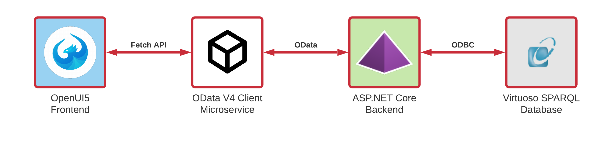
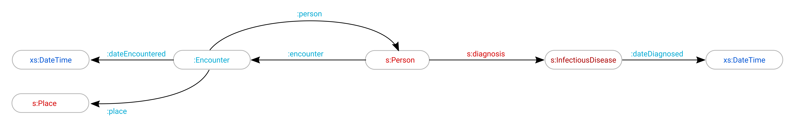

# COVID-19 RDF Tracker Simulation
Disclaimer: This is just a simulation and does not propose a competetive alternative to existing Contact Tracing apps.

There are several **Contact Tracing** apps like *Corona-Warn-App (CWA)*, *COVID Tracker Ireland* or *Smittestopp* which take advantage of the Bluetooth-based Exposure Logging feature for exchanging anonymous digital identities for anticipating and mitigating potential infection chains.

This **COVID-19 RDF Tracker** application simulates such use case based on a **Semantic Graph Database** where its pattern matching capabilities with **SPARQL** can predicate whether or not users are endangered based on their recent encounters with others. This simulation allows you to select fictional user entities for the purpose of either marking them as *infected* or create an encounter with other users to demonstrate the effectiveness of **Linked Data** for identifying potentially endangered users.

## Prerequisites
 - Node.js v10+
 - ASP.NET Core 3.1
 - OpenLink Virtuoso
 
## Deployment
To deploy the app, it is important that OpenLink Virtuoso is installed and running on your PC or Docker as the backend is dependent on it. Attached to this repository are several batch files for installing the relevant dependencies.

Once that has been considered, the application can be launched with the provided **'Run App.bat'** file for initializing the OData V4 Client microservice, the Linked Data Server and the OpenUI5 frontend simultaneously.

Trinity RDF ensures that the provided dataset is automatically uploaded to OpenLink Virtuoso upon its initialization. That means that you don't need to worry about making any post-installation configurations for OpenLink Virtuoso.

## Using the App
Once the application is deployed, the frontend service can be accessed via http://localhost:3000/. After accessing it, a list of fictional users will appear whose *COVID Health Status* are displayed as *No risk*.

A user can be selected by clicking on their proprietary row which will expand the Master View with the Detail View of the selected user whose information regarding their *COVID Health Status*, *recently visited location*, *encounters* and *diagnoses* are displayed.

The Detail View features two buttons:
- **Submit Diagnosis** button for declaring that user as *infected*.
- **Record Encounter** button for reporting a new encounter with other users.

By clicking on either of these buttons, an event on the backend will be triggered which calculates their *COVID Health Status* of all users and outputs their changes on the frontend.

An encounter row can also be selected for expanding the current view with an additional Detail-Detail View for displaying the information about that encounter with respect to its location, time, participants and risk level.

## Tech Stack
- COVID-19 Tracker Frontend
	- Node.js
		- Express.js
		- OpenUI5
- OData V4 Client
	- Node.js
		- Express.js
		- o.js
- Linked Data server
	- ASP.NET Core 3.1
		- Trinity RDF
		- OData
- Semantic Graph Database
	- OpenLink Virtuoso

## System Architecture

## RDF Data Model / Ontology

## COVID Risk Metric
The application uses the following metric for calculating a user's *COVID Health Status*:
- **No risk:**
A user is not endangered if they have no diagnosis or have been part of none or many encounters whose participants were not endangered either.
- **Potential risk:**
A user is potentially endangered if they have no diagnosis but have been part of one or many encounters where at least one participant has a diagnosis.
- **Infected:**
A user is infected if they have a diagnosis.